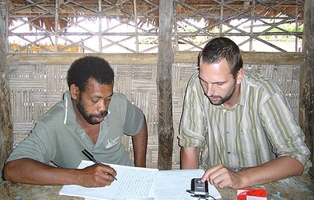

# Multi-CAST Vera'a

## How to cite

If you use these data please cite
- the original source
  > Schnell, Stefan. 2015. Multi-CAST Vera'a. In Haig, Geoffrey & Schnell, Stefan (eds.), Multi-CAST: Multilingual corpus of annotated spoken texts. Version 1505. Bamberg: University of Bamberg. (multicast.aspra.uni-bamberg.de/#veraa) (date accessed)
- the derived dataset using the DOI of the [particular released version](../../releases/) you were using



## Description


**Vera'a** ([vera1241](https://glottolog.org/resource/languoid/id/vera1241)) is an Oceanic (Austronesian) language from the village of the same name on Vanua Lava (13.80°S 167.47°E), one of the Banks Islands in North Vanuatu. The language has approximately 450 speakers and is the first language of most inhabitants of Vera'a and the coastline to the north of it. Vera'a is closely related to the neighbouring language Vurës, and speakers of Vera'a also speak Vurës.

Both languages have been extensively documented within a VolkswagenStiftung-funded [DOBES documentation project](http://dobes.mpi.nl/projects/vures_veraa/) (2006–2012; PI: Dr Catriona Hyslop-Malau). Vera'a has been the focus of Stefan Schnell's PhD project at Kiel University (2007–2010, see [Schnell 2011](Source#cldf:schnell2011)), and Stefan has subsequently been undertaking additional documentary work on Vera'a as part of his ARC-funded DECRA project *Typology of Language Use* (ARC grant no. DE120102017) in 2012–2015, hosted by La Trobe University (Melbourne, Australia).

The Multi-CAST Vera'a corpus consists of 10 folkloristic narrative texts collected and annotated by Stefan Schnell. They constitute a subcorpus of a larger corpus of Vera'a compiled and curated by Stefan Schnell in close collaboration with speakers of the language and researchers of other disciplines from outside the community. Annotations with RefIND were added to the corpus in 2019 by Stefan Schnell and Maria Vollmer.

The texts in this corpus (version 2207) have been time-aligned at the phone level for a [data set](https://doreco.huma-num.fr/languages/vera1241) in the [DoReCo project](https://doreco.huma-num.fr/).

This dataset is licensed under a CC-BY-4.0 license

Available online at https://multicast.aspra.uni-bamberg.de/#veraa


```geojson
{
    "type": "FeatureCollection",
    "features": [
        {
            "type": "Feature",
            "geometry": {
                "type": "Point",
                "coordinates": [
                    167.428701,
                    -13.892528
                ]
            }
        },
        {
            "type": "Feature",
            "geometry": {
                "type": "Polygon",
                "coordinates": [
                    [
                        [
                            162.428701,
                            -8.892528
                        ],
                        [
                            172.428701,
                            -8.892528
                        ],
                        [
                            172.428701,
                            -18.892528
                        ],
                        [
                            162.428701,
                            -18.892528
                        ],
                        [
                            162.428701,
                            -8.892528
                        ]
                    ]
                ]
            }
        }
    ]
}
```


## Corpus counts

Only a small number of basic GRAID symbols are counted:

*Function symbols*
- ⟨0⟩ zero
- ⟨pro⟩ definite pronoun
- ⟨np⟩ full noun phrase
- ⟨other⟩ form not further specified

*Person/Animacy symbols*
- ⟨.1⟩ first person
- ⟨.2⟩ second person
- ⟨.h⟩ third person, human
- ⟨.d⟩ third person, anthropomorphic
- ø third person, non-human

*Function symbols*
- ⟨:s⟩ subject of an intransitive clause
- ⟨:a⟩ subject of a transitive clause
- ⟨:ncs⟩ non-canonical subject
- ⟨:p⟩ direct object
- ⟨:obl⟩ oblique argument
- ⟨:g⟩ goal argument
- ⟨:l⟩ locational argument
- ⟨:pred⟩ predicate
- ⟨:poss⟩ possessive
- ⟨:other⟩ function not further specified

Only basic categories are listed; categories represented by complex symbols with additional
specifiers (e.g. ⟨dem_pro⟩ ‘demonstrative pronoun’) have been subsumed under the more basic
category (e.g. ⟨pro⟩ ‘definite pronoun’). Please refer to the annotation notes for this corpus for
information on all annotated categories, including those not listed here.

| GRAID | ⟨:s⟩ | ⟨:a⟩ | ⟨:ncs⟩ | ⟨:p⟩ | ⟨:obl⟩ | ⟨:g⟩ | ⟨:l⟩ | ⟨:pred⟩ | ⟨:poss⟩ | ⟨:other⟩ | totals |
|:--------------|-------:|-------:|---------:|-------:|---------:|-------:|-------:|----------:|----------:|-----------:|---------:|
| **⟨0.1⟩** | 8 | 3 | 0 | 2 | 0 | 0 | 0 | 0 | 0 | 0 | 13 |
| **⟨0.2⟩** | 29 | 13 | 0 | 1 | 0 | 0 | 0 | 0 | 0 | 0 | 43 |
| **⟨0.h⟩** | 366 | 182 | 0 | 19 | 10 | 1 | 0 | 0 | 0 | 0 | 578 |
| **⟨0.d⟩** | 134 | 86 | 0 | 14 | 1 | 0 | 0 | 0 | 0 | 0 | 235 |
| **⟨0⟩** | 79 | 16 | 0 | 156 | 14 | 8 | 3 | 0 | 0 | 0 | 276 |
| **⟨pro.1⟩** | 230 | 97 | 0 | 38 | 11 | 6 | 0 | 3 | 33 | 1 | 419 |
| **⟨pro.2⟩** | 170 | 81 | 0 | 38 | 5 | 8 | 0 | 0 | 13 | 1 | 316 |
| **⟨pro.h⟩** | 985 | 484 | 0 | 119 | 11 | 55 | 0 | 0 | 93 | 0 | 1747 |
| **⟨pro.d⟩** | 305 | 97 | 0 | 15 | 0 | 13 | 0 | 0 | 6 | 0 | 436 |
| **⟨pro⟩** | 143 | 30 | 0 | 3 | 0 | 1 | 0 | 4 | 2 | 1 | 184 |
| **⟨np.1⟩** | 0 | 0 | 0 | 0 | 0 | 0 | 0 | 0 | 0 | 0 | 0 |
| **⟨np.2⟩** | 0 | 0 | 0 | 0 | 0 | 0 | 0 | 0 | 0 | 0 | 0 |
| **⟨np.h⟩** | 260 | 62 | 0 | 84 | 11 | 44 | 0 | 47 | 53 | 4 | 565 |
| **⟨np.d⟩** | 109 | 27 | 0 | 24 | 5 | 21 | 0 | 12 | 11 | 0 | 209 |
| **⟨np⟩** | 172 | 26 | 0 | 475 | 68 | 244 | 100 | 87 | 4 | 204 | 1380 |
| **⟨other.1⟩** | 0 | 0 | 0 | 0 | 0 | 0 | 0 | 0 | 0 | 0 | 0 |
| **⟨other.2⟩** | 0 | 0 | 0 | 0 | 0 | 0 | 0 | 0 | 0 | 0 | 0 |
| **⟨other.h⟩** | 0 | 0 | 0 | 0 | 0 | 0 | 0 | 0 | 0 | 0 | 0 |
| **⟨other.d⟩** | 0 | 0 | 0 | 0 | 0 | 0 | 0 | 0 | 0 | 0 | 0 |
| **⟨other⟩** | 5 | 0 | 0 | 0 | 12 | 59 | 111 | 279 | 0 | 0 | 466 |
| | 2995 | 1204 | 0 | 988 | 148 | 460 | 214 | 432 | 215 | 211 | 6867 |


**Clause boundaries**

| GRAID | count |
|:-----------|--------:|
| **⟨##⟩** | 3233 |
| **⟨#⟩** | 306 |
| **totals** | 3539 |


## Corpus metadata

- [Annotation notes](cldf/media/annotation-notes.pdf)
- [Metadata](cldf/media/metadata.pdf)
- [Translated texts](cldf/media/translated-texts.pdf)


## CLDF Datasets

The following CLDF datasets are available in [cldf](cldf):

- CLDF [TextCorpus](https://github.com/cldf/cldf/tree/master/modules/TextCorpus) at [cldf/TextCorpus-metadata.json](cldf/TextCorpus-metadata.json)